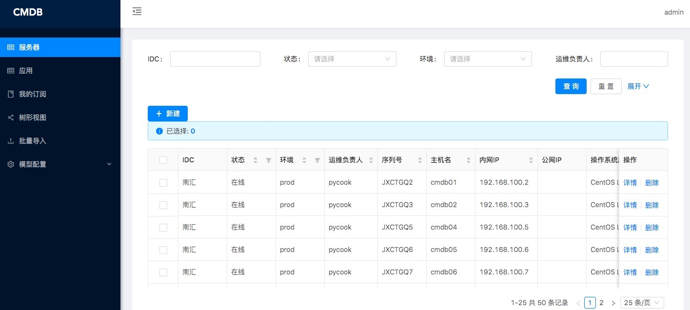
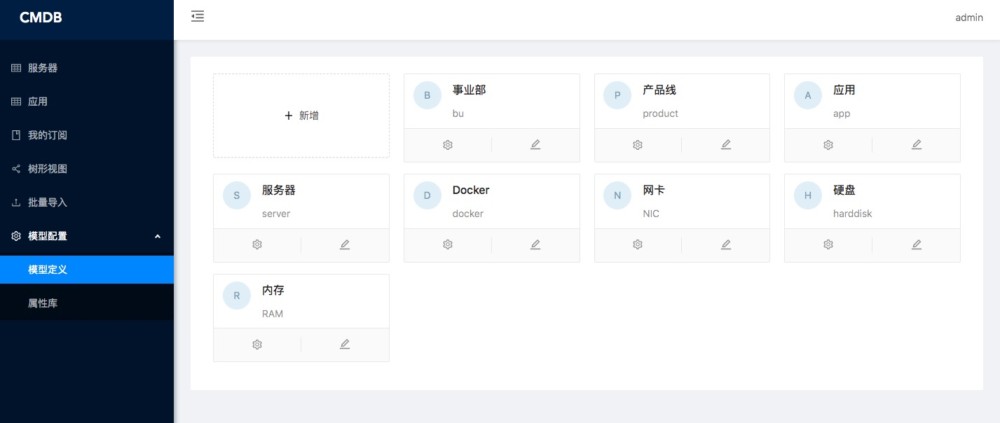

<h1 align="center">CMDB</h1>
<div align="center">
尽可能实现比较通用的运维资产数据的配置和管理
</div>

<div align="center">

[](https://github.com/pycook/cmdb/blob/master/LICENSE)
[](https://github.com/sendya/ant-design-pro-vue) 
[](https://github.com/pallets/flask) 

</div>


- 在线预览: [CMDB](url "http://39.100.252.148:8000")
    - username: admin
    - password: admin
    
Overview
----




环境和依赖
----
- 存储: mysql, redis
- python版本: python2.7, >=python3.6


安装
----
- 创建数据库cmdb

- 拉取代码
```bash
git clone https://github.com/pycook/cmdb.git
cd cmdb
cp api/settings.py.example api/settings.py
```
设置api/settings.py里的database

- 安装库
  - 后端: ```pipenv run pipenv install```
  - 前端: ```cd ui && yarn install && cd ..```
  
- 创建数据库表 ```flask run flask db-setup```
  
- 启动服务
  - 后端: ```pipenv run flask run```
  - 前端: ```cd ui && yarn run serve```
  - 浏览器打开:  [http://127.0.0.1:8000](http://127.0.0.1:8000)

