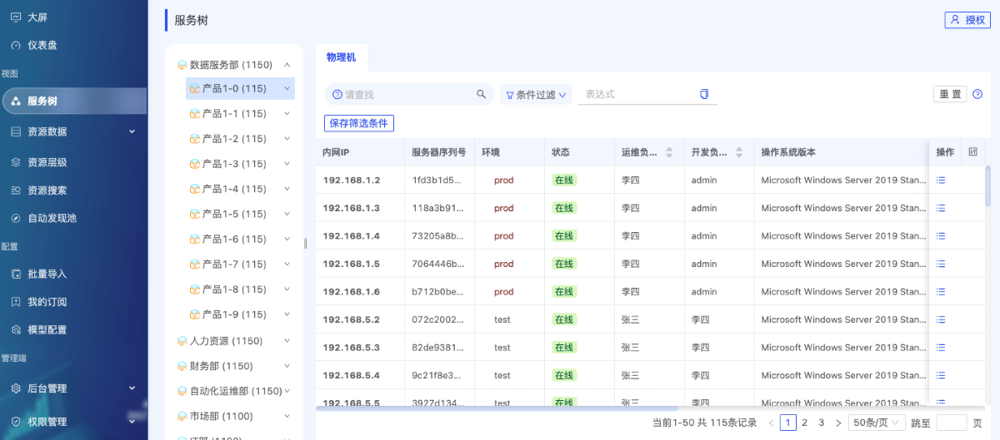

[](https://github.com/veops/cmdb/blob/master/LICENSE)
[](https://github.com/sendya/ant-design-pro-vue)
[](https://github.com/pallets/flask)

[English](docs/README_en.md) / [中文](README.md)
- 产品文档：https://veops.cn/docs/
- 在线体验: <a href="https://cmdb.veops.cn" target="_blank">CMDB</a>
  - username: demo 或者 admin
  - password: 123456

> **重要提示**: `master` 分支在开发过程中可能处于 _不稳定的状态_ 。
> 请通过[releases](https://github.com/veops/cmdb/releases)获取

## 系统介绍

### 整体架构


### 相关文档

- <a href="https://mp.weixin.qq.com/s/v3eANth64UBW5xdyOkK3tg" target="_blank">概要设计</a>
- <a href="https://github.com/veops/cmdb/tree/master/docs/cmdb_api.md" target="_blank">API 文档</a>
- <a href="https://mp.weixin.qq.com/s/rQaf4AES7YJsyNQG_MKOLg" target="_blank">自动发现</a>

### 特点

- 灵活性
  1.  规范并统一纳管复杂数据资产
  2.  自动发现、入库 IT 资产
- 安全性
  1. 细粒度访问控制
  2. 完备操作日志
- 多应用
  1. 丰富视图展示维度
  2. 提供 Restful API
  3. 支持定义属性触发器、计算属性

### 主要功能

- 模型属性支持索引、多值、默认排序、字体颜色，支持计算属性
- 支持自动发现、定时巡检、文件导入
- 支持资源、树形、关系视图展示
- 支持模型间关系配置和展示
- 细粒度访问控制，完备的操作日志
- 支持跨模型搜索

### 系统概览

- 服务树



[查看更多展示](docs/screenshot.md)


### 更多功能

> 也欢迎移步[维易科技官网](https://veops.cn)，发现更多免费运维系统。

## 接入公司

> 欢迎使用开源CMDB的公司，在 [#112](https://github.com/veops/cmdb/issues/112) 登记

## 安装

### Docker 一键快速构建
- 进入主目录（先安装 docker 环境, 注意要clone整个项目）

```
docker-compose up -d
```

- 浏览器打开: [http://127.0.0.1:8000](http://127.0.0.1:8000)
- username: demo 或者 admin
- password: 123456

### [本地开发环境搭建](docs/local.md)

### [Makefile 安装](docs/makefile.md)

---

_**欢迎关注我们的公众号，点击联系我们，加入微信、QQ群(336164978)，获得更多产品、行业相关资讯**_


