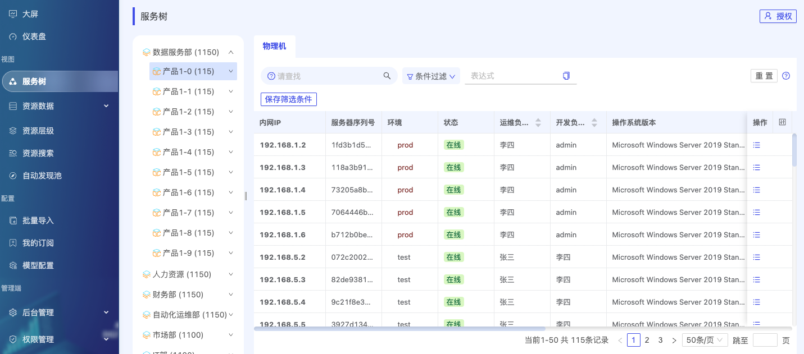

[English](README_en.md) / [中文](README.md)

## DEMO ONLINE

- Preview online: <a href="https://cmdb.veops.cn" target="_blank">CMDB</a>
  - username: demo
  - password: 123456

> **ATTENTION**: branch `master` may be unstable as the result of continued development, please pull code from [releases](https://github.com/veops/cmdb/releases)

## Overview

### Technical Architecture

### Document

- <a href="https://zhuanlan.zhihu.com/p/98453732" target="_blank">Design Document</a>
- <a href="https://github.com/veops/cmdb/tree/master/docs/cmdb_api.md" target="_blank">API Documentation</a>
- <a href="https://mp.weixin.qq.com/s/EflmmJ-qdUkddTx2hRt3pA" target="_blank">Practice of Tree View</a>

### Features

- Flexibility
  1. Standardize and manage complex data assets
  2. Automatically discover and inventory IT assets
- Security
  1. Fine-grained access control
  2. Comprehensive operation logs
- Multi-application
  1. Rich view display dimensions
  2. Provide Restful API
  3. Custom field triggers

### Main Features

- Model attributes support indexing, multiple values, default sorting, font color, and computed properties.
- Support automatic discovery, scheduled inspections, and file import.
- Support resource, tree view, and relationship view display.
- Support configuration and display of relationships between models.
- Fine-grained access control and comprehensive operation logs.
- Support cross-model search.

### System Overview

- Service Tree
  

[View more screenshots](docs/screenshot.md)

### More Features

> Welcome to visit VeOps official website to discover more free operations and maintenance systems.

## Recommended

[Spug - Open source lightweight automated operation and maintenance platform](https://github.com/openspug/spug)

## Installation

### [One-Click Docker Quick Build](docs/docker_en.md)

### [Local Setup](docs/local_en.md)

### [Installation with Makefile](docs/makefile_en.md)

## Contributing

1. Fork it
1. Create your feature branch (`git checkout -b my-feature`)
1. Commit your changes (`git commit -am 'Add some feature'`)
1. Push to the branch (`git push origin my-feature`)
1. Create new Pull Request

---

_**Welcome to join us through QQ group（336164978）**_

