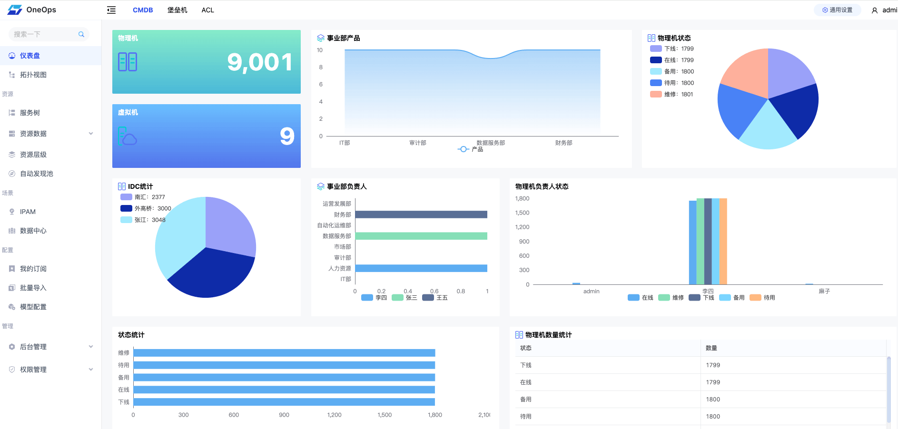
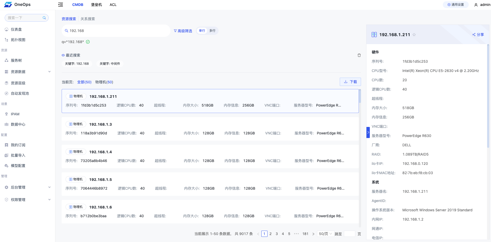
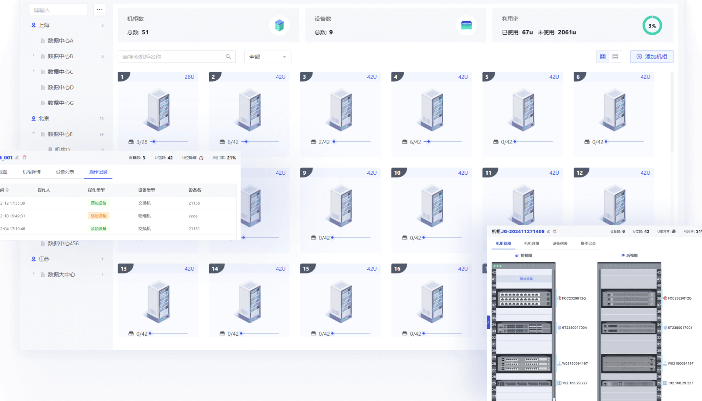
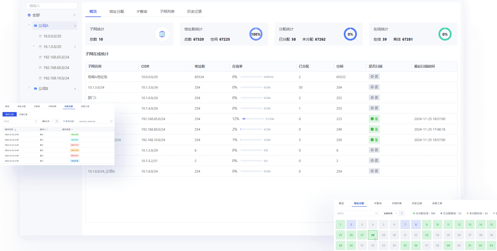

<h2 align="center">Simple, lightweight, and versatile operational CMDB</h2>

  
  
  
  
  

  English · <a href="../README.md">中文(简体)</a>

## Introduce 
VE CMDB is a simple, lightweight and highly customizable operations and maintenance configuration management database (CMDB). It supports flexible model configuration and resource auto-discovery, and is designed to provide organizations with a convenient asset management solution that helps operations teams efficiently manage IT infrastructure and services.

- Product document：[https://veops.cn/docs/](https://veops.cn/docs/)
- Preview online: [https://cmdb.veops.cn](https://cmdb.veops.cn)
  - username: demo
  - password: 123456
- **ATTENTION**: branch `master` may be unstable as the result of continued development, Please use [releases](https://github.com/veops/cmdb/releases) to get the latest stable version

### Features

- **Custom Model and Model Relationships**: Supports customization of model attributes, including drop-down lists, font colors, calculated attributes and other advanced functions to meet different business needs.  
- **Auto-discovery of resources**: supports auto-discovery of computers, network devices, storage devices, databases, middleware, public cloud resources, etc.
- **Multi-dimensional view display**: including resource view, hierarchical view, relationship view, etc., helping O&M personnel to comprehensively manage resources.
- **Fine-grained privilege control**: ensure system security through precise access control and complete operation logs.
- **Comprehensive Resource Search Function**: Supports flexible resource and relationship search to quickly locate and operate resources.
- **Integrated IP Address Management (IPAM) and Data Center Infrastructure Management (DCIM) features**: Simplify the management of network resources and data center equipment.

For more detailed features, please visit the [official website](https://veops.cn).

### System Characteristics

- Flexibility
  + No need to specify fixed operation and maintenance scenarios, supports free configuration and built-in multiple templates.
  + Support automatic discovery and inventory of IT assets, quickly set up an asset management system.
- Security
  + Fine-grained permission control mechanism to ensure the security of resource management.
  + Complete operation logs for easy auditing and problem tracking.
- Multi-application
  + Provides multiple views to meet the needs of different scenarios.
  + Powerful API interface supports deep integration.
  + Support for defining attribute triggers and calculating attributes to enhance data processing capabilities.

### Tech Stack

+ Back-end: Python [3.8-3.11].
+ Data Storage: MySQL, Redis
+ Front-end: Vue.js
+ UI component library: Ant Design Vue

### Overview

<table style="border-collapse: collapse; border: 1px solid black;">
  <tr>
    <td style="padding: 5px;background-color:#fff;">
      
    </td>
    <td style="padding: 5px;background-color:#fff;">
      
    </td>
  </tr>

  <tr>
    <td style="padding: 5px;background-color:#fff;">
      
    </td>
    <td style="padding: 5px;background-color:#fff;">
      
    </td>
  </tr>
</table>

## Quick Start

### 1. Set up

+ Option 1: Docker One-Click Quick Builds

  - Step 1: Install Docker environment and Docker Compose (v2)
  - Step 2: Copy the project code, `git clone https://github.com/veops/cmdb.git`
  - Step 3: Enter the home directory and start, `docker compose up -d`

+ [Local Setup](local_en.md)
+ [Installation with Makefile](makefile_en.md)

### 2. Visit
- Open your browser and visit: [http://127.0.0.1:8000](http://127.0.0.1:8000)
- Username: demo or admin
- Password: 123456

## Access Company

+ Companies using the open source CMDB are welcome to record in [#112](https://github.com/veops/cmdb/issues/112)

## Contributing
We welcome all developers to contribute code to improve and extend this project. Please read our [contribution guidelines](./CONTRIBUTING_en.md) first. Additionally, you can support Veops open source through social media, events, and sharing.

## Enterprise Edition

Compared to the Community Edition, VE Enterprise Edition provides a large number of enhancements and technical support services for enterprises. Enhancements include data compliance, data cascading, auto-discovery extensions, large screen customization, and more. [Enterprise Edition Details](https://veops.cn/cmdb)

## VE Technology's other open source projects

- [OneTerm](https://github.com/veops/oneterm): Provide secure access and control over all infrastructure.
- [messenger](https://github.com/veops/messenger): A simple and lightweight message sending service.
- [ACL](https://github.com/veops/acl): A general permission control management system.
- [ops-tools](https://github.com/veops/ops-tools): Common practices and code for operations and maintenance.

## Contact me

+ Email: <a href="mailto:bd@veops.cn">bd@veops.cn</a>